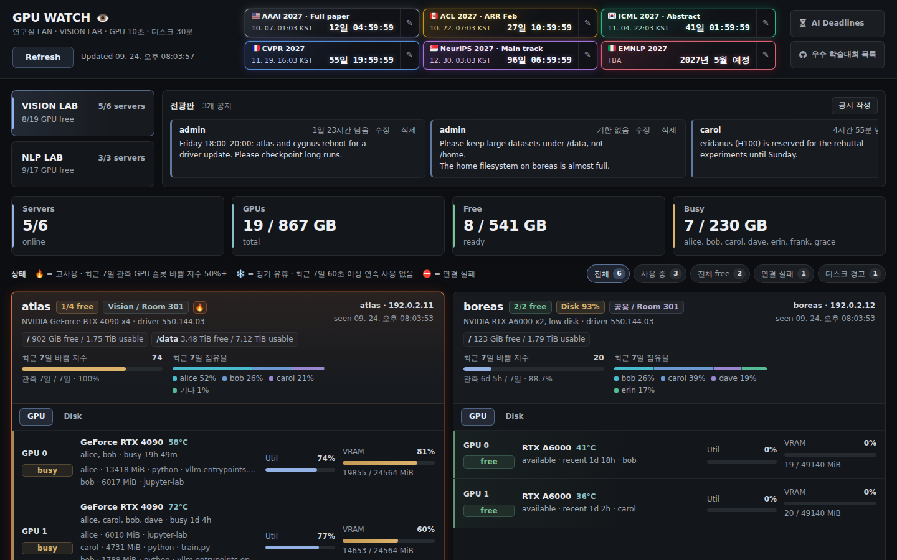

# GPU Watch Dashboard v3

研究室で共有する GPU サーバーのための、軽量でエージェント不要のダッシュボードです。いま空いている GPU、使用中の GPU を使っている人、残りのディスク容量がひと目でわかります。データは通常の SSH だけで収集します。

[English](README.md) | [简体中文](README.zh-CN.md) | [繁體中文](README.zh-HK.md) | **日本語** | [한국어](README.ko.md)



<sub>架空のデモデータで撮影した画面です。UI は韓国語で、技術用語は英語で表記しています。</sub>

## GPU Watch を使う理由

共有サーバーでジョブを始める前には、たいてい三つのことを確かめる必要があります。どの GPU が空いているか、使用中の GPU は誰が使っているか、ディスクに十分な空きがあるかです。GPU Watch はこの三つを一つのページで答えます。

- **エージェント不要。** 各 GPU サーバーに必要なのは SSH アクセス、`nvidia-smi`、`python3` だけです。サーバーに常駐するプログラムはありません。
- **軽量。** バックエンドは Python 標準ライブラリと SQLite だけを使います。フロントエンドはビルド工程のない素の HTML、CSS、JavaScript です。
- **慎重。** プロセスの所有者を推測せず、完全なコマンドラインも表示しません。古い測定値を現在の値のように見せることもありません。

## v3 の変更点

- **プロセスの所有者**は `/proc/<pid>/status` の実効 UID で判定します。`/proc` のディレクトリが root 所有に見えるプロセス（non-dumpable なプロセス）も、正しいユーザーに帰属します。
- **GPU の取得に失敗してもディスクは更新を続けます。** SSH はつながるのに、NVIDIA ドライバーの不一致などで GPU の取得だけが失敗する場合です。
- **任意で使える特権ディスクヘルパー**により、監視用アカウントがほかのユーザーのホームディレクトリを読めないサーバーでも、ユーザー別の使用量を測定できます。[特権ディスクヘルパー](#特権ディスクヘルパー)を参照してください。
- **Artificial Analysis の更新が API の利用上限に従います。** 固定の 6 時間ではなく、レスポンスのレート制限ヘッダーから間隔を決めます。
- **セキュリティ強化。** お知らせの作成も、パスワードハッシュの同時実行制限を共有するようになりました。Caddy のビルドは、修正済みの OpenTelemetry モジュールに固定しています。
- **すべてのファイルを LF の改行でチェックアウトする**ため、Linux の本番環境と Windows のコピーでリリースのフィンガープリントが一致します。
- **画面の調整。** タイマーの残り時間をカードの縦方向の中央に配置します。長いタイトルを優先し、必要に応じて残り時間を二行に分けます。それでも収まらないタイトルは省略記号で示し、マウスを重ねると全文を表示します。スマートフォンでは Intelligence Index がよりコンパクトになり、韓国語は語の区切りで改行します。

## 機能

### GPU とサーバー

- すべての GPU のリアルタイム状態：free（空き）か busy（使用中）か、使用率、VRAM、温度、使用中の時間または最終使用時刻。
- GPU ごとのプロセスと、そのユーザー、メモリ、短いコマンド要約。詳細表示では PID、開始時刻、コンテナも示しますが、完全なコマンドラインは表示しません。
- 研究室の切り替え、研究室全体のサマリー（オンラインのサーバー、free と busy の GPU、VRAM）、そして使用中・全 GPU 空き・接続失敗・ディスク警告の各フィルター。
- アクティビティバッジ：🔥 高負荷（直近 7 日間のビジー指数が 50% 以上）、❄️ 長期アイドル（7 日間、60 秒以上の連続使用なし）、⛔ 接続失敗。

### ディスク

- ファイルシステムごとの空き、使用可能、使用中、予約済みの容量。使用率 90% で警告します。
- 読み取り可能なホームディレクトリと設定したパス、さらに Docker の書き込みレイヤーを合計したユーザー別使用量。集計が一部にとどまる場合、下限値は `≥`、推定値は `≈` で示します。

### 履歴と推移

- busy/free の切り替わりを記録する Recent Activity。日付、サーバー、ユーザーで絞り込めます。接続の DOWN/UP イベントは既定では非表示で、含めて表示することもできます。
- サーバーごとの直近 7 日間のビジー指数と、ユーザー別の使用割合。
- LAB DAILY INDEX：直近 24 時間の 1 時間ごとの VRAM ローソク足と、30 日間の日平均 VRAM の推移。

### 研究室向けツール

- 最大 6 件の学会締め切りカウントダウン（KST）。TBA の項目にも対応します。タイマー名に含まれる国旗の絵文字は、同梱の SVG ファイルで描画します。
- 有効期限を任意で設定できる掲示板のお知らせ。投稿者は自分で決めたパスフレーズでお知らせを編集でき、管理者は管理者 PIN ですべてのお知らせを管理できます。
- 学会締め切りサイト、AI サービスのステータスページ、AI ニュースへのクイックリンク。Artificial Analysis Intelligence Index（上位 29 モデル）も表示します。データはサーバーが取得するため、API キーがブラウザーに渡ることはありません。

### 日常の使いやすさ

- 既定では 10 秒ごとに自動更新します。更新しても選択中のタブ、スクロール位置、キーボードフォーカスは保たれ、バックグラウンドのタブでは更新間隔を延ばします。データの更新が止まるとバナーで知らせます。
- 幅 320px の画面、キーボード操作、OS の「動きを減らす」設定に対応します。リリース時に文字のコントラスト、フォーカス表示、画面幅ごとのレイアウトを確認します。

## 仕組み

```text
Browser ──HTTP──▶ Caddy  (IP allowlist, compression)
                    │
                    ▼
              server.py   (HTTP API · collector · maintenance)
               │      │
          SSH  │      └──▶ SQLite  (data/)
               ▼
          GPU servers  (nvidia-smi · /proc · df · du · docker)
```

1. コレクターは `poll_interval_seconds`（10 秒）ごとに、`hosts.json` のすべてのホストへ並列に接続します。各ホストで `nvidia-smi` のクエリと小さなインライン Python プローブを実行します。
2. プロセスの所有者は `/proc/<pid>/status` の実効 UID と NSS 名から決め、PID の開始時刻と GPU UUID で再確認します。確認できない場合は推測せず、不明として表示します。
3. ディスク使用量は `disk_poll_interval_seconds`（30 分）ごとに、`df`、時間制限付きの `du`、`docker ps --size` で測定します。任意の特権ヘルパーを使うこともできます。
4. 観測値は時間区間として SQLite に保存します。重なり合う GPU、プロセス、ユーザーはまとめて扱うため、使用時間が二重に数えられることはありません。
5. ページは `/api/snapshot`、`/api/events`、`/api/insights`、`/api/intelligence-index` を読み込みます。

### 状態の判定ルール

- GPU に計算プロセスがある、VRAM を 500 MiB 以上使っている、または使用率が 10% 以上のとき、その GPU は **busy** です。二つのしきい値は設定で変更できます。
- VRAM を確保し続けているプロセスは、使用率が 0% でも busy とみなします。そのため、押さえてある GPU が free と表示されることはありません。
- SSH 接続か GPU の取得かを問わず、GPU を完全に観測できなかったサーバーは **DOWN** です。その GPU はどれも利用可能に数えず、以前の測定値を現在の値として表示しません。ディスクの取得に成功しても、DOWN のサーバーを UP には戻しません。

## セキュリティモデル

- **アクセス制御。** Caddy が IP 許可リストを適用します。アプリもクライアント IP、`Host`、`Origin` を独自に再確認します。
- **書き込み。** お知らせやタイマーの変更には、同一オリジンからのリクエストとパスフレーズまたは PIN が必要です。ハッシュには 600,000 回反復の PBKDF2-SHA256 を使います。ハッシュの検証は同時に 2 件までに抑え、失敗した試行はサブネット単位と全体の両方でレート制限します。
- **制限されたプロセス情報。** 完全なコマンドライン、環境変数、認証情報はブラウザーに送らず、整形した短い要約だけを提供します。運用エラーは長さを制限し機密値を伏せますが、ホストのアドレスやポートを含む場合があり、ネットワーク構成を隠す機能ではありません。サーバーカードには検証済みの IP アドレスを意図的に表示します。
- **ブラウザー側の保護。** 厳格なコンテンツセキュリティポリシー（CSP）がインラインスクリプトを遮断します。アイコンや国旗は外部ホストではなくローカルから配信します。
- **コンテナ。** root 以外のユーザーで実行し、ルートファイルシステムは読み取り専用、すべてのケーパビリティを削除し、`no-new-privileges` と PID・メモリ・ログの制限を適用します。
- **機密情報。** SSH パスワード、API キー、PIN のハッシュは git の管理対象外のランタイム用フォルダー（`secrets/`、`data/`、`operator-secrets/`）にだけ置き、リポジトリには含めません。SSH パスワードはコマンドラインではなく `SSH_ASKPASS` を通じて OpenSSH に渡します。
- **通信経路。** 平文の HTTP は信頼できる LAN 内での利用を前提にしています。より広く公開する前に、TLS と認証を追加してください。

## 動作要件

| 場所 | 必要なもの |
|---|---|
| ダッシュボードのホスト | Python 3.12（標準ライブラリのみ）と OpenSSH クライアント、または Docker |
| 各 GPU サーバー | 監視用アカウントの SSH アクセス、`nvidia-smi` を含む NVIDIA ドライバー、`python3`、`df`、GNU `du`。Docker は任意で、あればコンテナごとの使用量も表示します。特権ディスクヘルパーを使う場合は `sudo` も必要です。 |
| 閲覧者 | 最新の Web ブラウザー |

## クイックスタート

```sh
git clone https://github.com/jumincho/gpu-watch.git
cd gpu-watch

# 1. サーバーの一覧を書きます（下の「設定」を参照）。
$EDITOR hosts.json

# 2. 管理者 PIN を作成します。一度だけ使う平文の PIN の保存先が表示されます。
python3 scripts/admin-passphrase.py ensure

# 3. ダッシュボードを起動します。
python3 server.py --host 127.0.0.1 --port 8787
```

<http://127.0.0.1:8787/> を開きます。既定ではループバックのクライアントしか接続できません。LAN 内のほかのマシンから見る場合は、許可する対象を明示してください。以下のアドレスは例です。

```sh
GPU_WATCH_ALLOWED_NETWORKS="127.0.0.0/8,::1/128,192.0.2.0/24" \
GPU_WATCH_ALLOWED_HOSTS="192.0.2.10:8787,127.0.0.1:8787,localhost:8787" \
python3 server.py --host 0.0.0.0 --port 8787
```

## 設定

### `hosts.json`

同梱の `hosts.json` は架空の研究室を記述したものです。自分のサーバーに置き換えて使ってください。

```json
{
  "poll_interval_seconds": 10,
  "disk_poll_interval_seconds": 1800,
  "busy_memory_threshold_mib": 500,
  "busy_utilization_threshold_percent": 10,
  "labs": [{ "id": "vision", "label": "VISION LAB" }],
  "hosts": [
    {
      "name": "atlas",
      "label": "atlas",
      "lab": "vision",
      "ssh_host": "192.0.2.11",
      "ssh_port": 22,
      "ssh_user": "gpuwatch",
      "ssh_identity_file": "~/.ssh/id_ed25519",
      "expected_gpu_count": 4,
      "note": "NVIDIA GeForce RTX 4090 x4",
      "owner": "Vision",
      "owner_type": "assigned",
      "location": "Room 301"
    }
  ]
}
```

| ホストのフィールド | 意味 |
|---|---|
| `name` | 一意の ID（英字、数字、`.`、`_`、`-`）。`ssh_host` を省略した場合は SSH のエイリアスとしても使います。 |
| `label`、`lab` | 表示名と所属する研究室 |
| `ssh_host`、`ssh_port`、`ssh_user` | 接続先 |
| `ssh_identity_file` | 鍵認証に使う秘密鍵 |
| `ssh_password_file`、`ssh_options` | パスワード認証。パスワードファイルは `secrets/` の下に置き、実行時に読み込みます。 |
| `display_ip` | エイリアスで接続するホストのカードに表示する IP |
| `expected_gpu_count` | サーバーが DOWN のあいだも表示し続ける GPU の枠の数 |
| `note`、`owner`、`owner_type`、`location` | カードに表示する文言とバッジのスタイル（`assigned` または `shared`） |
| `disk_user_paths` | 追加で測定するユーザー別のパス。`{ "user": …, "path": … }` の形式です。 |
| `collect_docker_usage` | `docker ps --size` で Docker の書き込みレイヤーも測定します。既定で有効なのは `nll` 研究室のホストだけです。 |
| `privileged_disk_helper` | インストールした root ヘルパーでディスク使用量を測定します。`disk_user_paths` とは併用できません。 |

このほかのトップレベルの設定には、プローブのタイムアウト、`collector_workers`、🔥 と ❄️ のバッジの基準を決める `activity_policy`、保存期間などがあります。既定ではイベントを 180 日、日次バックアップを 14 日間保存します。お知らせは削除または期限切れから 90 日後に消去し、期限のないお知らせは削除するまで保持します。

### 環境変数

| 変数 | 用途 | 既定値 |
|---|---|---|
| `GPU_WATCH_ALLOWED_NETWORKS` | クライアント IP の許可リスト（カンマ区切りの CIDR） | ループバック |
| `GPU_WATCH_ALLOWED_HOSTS` | 受け付ける `Host` ヘッダーの値 | ループバック |
| `GPU_WATCH_TRUSTED_PROXY_NETWORKS` | `X-Forwarded-For` ヘッダーを信頼するリバースプロキシ | ループバック |
| `GPU_WATCH_SSH_CONFIG_FILE` | 使用する OpenSSH 設定ファイルの絶対パス | なし |
| `GPU_WATCH_SSH_IDENTITY_FILE` | ホストごとの鍵ファイルの代わりに使う鍵ファイル | なし |
| `GPU_WATCH_ADMIN_PIN_HASH` | `data/admin_pin.hash` の代わりに使う管理者 PIN のハッシュ | なし |
| `GPU_WATCH_RUNTIME_MODE` | `standalone`、`production`、`emergency` のいずれか | `standalone` |
| `GPU_WATCH_BUILD_VERSION` | フッターに表示するリリース番号 | `VERSION` |

### Artificial Analysis

Intelligence Index を表示するには、API キーを `secrets/artificial_analysis_api_key` に置いてください。シンボリックリンクではない通常のファイルで、パーミッションは `0600` にする必要があります。ブラウザーが受け取るのはキャッシュ済みのランキングだけです。

- サーバーはレスポンスの `X-RateLimit-*` ヘッダーとページ数をもとに、全体の更新を利用上限の期間に均等に割り振ります。少しの予備（最大 8 回）を残し、15 分より短い間隔では更新しません。1 日 100 回の上限で 4 ページなら、およそ 1 時間に 1 回です。
- 残りの回数が足りないときは、上限がリセットされるまで待ちます。リクエストは送る前に回数を差し引くため、再起動やネットワークエラーのせいで回数が残っていると誤認することはありません。
- レート制限ヘッダーがない場合は 6 時間ごとに更新します。失敗したときは 1 時間後に再試行し、API がより長い `Retry-After` を返した場合はそれに従います。48 時間を超えたデータは古いデータとして表示します。
- 利用上限の状態（上限、残り回数、リセット時刻、ページ数、次の試行時刻）は、キーとは別に `data/` のキャッシュの隣に保存します。
- ページは 5 分ごとにサーバーのキャッシュを確認します。ページを開いている人がいない場合、更新は次のメンテナンス周期（既定では 1 時間）まで遅れることがあります。

## 特権ディスクヘルパー

監視用アカウントがほかのユーザーのホームディレクトリを読めないサーバーでは、ユーザー別の合計が一部の集計にとどまります。そうしたサーバーには、GPU Watch 自身のディスク収集処理だけを実行する小さな root ヘルパーをインストールできます。

```sh
# レビューできるインストーラーを生成します（インストールはしません）。
python3 scripts/provision-disk-helper.py --user gpuwatch --output disk-installer.py

# disk-installer.py を確認してから GPU サーバーにコピーし、管理者権限で実行します。
sudo python3 -I disk-installer.py
```

インストーラーは `/usr/local/libexec/gpu-watch-disk`、監視用アカウントがこのヘルパーだけを引数なしで実行できるようにする sudoers のルール、`/var/cache/gpu-watch/` のキャッシュフォルダーを作成します。ヘルパーはパス、コマンド、環境変数の入力を一切受け付けません。同時実行を防ぎ、結果を 5 分間キャッシュし、低い CPU 優先度で動きます。デーモンはインストールせず、管理者のパスワードも保存しません。

公開例では helper は既定で無効です。`privileged_disk_helper` が省略または false の場合、sudo は使いません。インストール後、そのホストだけに `"privileged_disk_helper": true` を設定してください。helper が見つからない場合は、同じ時間枠内で一般権限による集計に戻り、ユーザー別使用量を部分的な集計として表示します。

## デプロイ

基準となる本番構成は、強化した二つのコンテナで動きます。外部に公開するポートは Caddy だけで、アプリは内部の Docker ネットワークにとどまります。

- `Dockerfile` は、ダイジェストで固定した `python:3.12-alpine` イメージの上にアプリをビルドします。
- `Dockerfile.caddy` は、固定したコミットと固定した依存関係のバージョンで Caddy をビルドします。
- `deploy.sh` は研究室の本番ホスト向けのデプロイスクリプトです。パスと権限を確認し、二つのイメージをビルドして SSH と Caddy の設定を検証します。切り替え直前にアプリを停止し、SQLite オンラインバックアップを作成・検証します。以前のコンテナを保持したまま新しいデプロイの health とアクセス制御を確認し、失敗すればロールバックします。ほかの環境で使う場合は、まずホスト固有のパスとアドレスを変更してください。

リリースのフィンガープリントは、`VERSION`、`server.py`、`hosts.json`、`gpu_watch/`、`static/` のハッシュです。本番と緊急用コピーで一致している必要があります。

### Windows の緊急フォールバック

`emergency-local-fallback.ps1 -Action Status|Start|Stop` は Windows の緊急用コピーを管理します。まず参照用のパス、本番アドレス、SSH 設定、LAN 範囲を自分の環境に合わせてください。`Start` は `-Force` がない限り、本番が応答すると起動を拒否します。`VERSION`、release fingerprint、新しい収集結果を確認し、ファイアウォールを指定した LAN に限定します。`Stop` は自分が作成したリスナー、ファイアウォール規則、一時パスワードファイルを削除します。ローカル DB は別なので、復帰前に障害中に作成したお知らせやタイマーを照合してください。

## 運用

```sh
# 実行中のコンテナの状態を確認する
docker exec gpu-watch-dashboard python3 /app/scripts/check_local.py --health-only --expected-build-version 3

# SQLite の整合性と集計の不変条件を検査する
python3 scripts/audit-data.py data/gpu_watch.sqlite3

# data/backups 内のバックアップを復元（パス・SQLite 整合性・外部キー・スキーマを検証）
sh scripts/restore-backup.sh "$PWD/data/backups/backup.sqlite3"
```

メンテナンス処理が SQLite の日次バックアップを作成し、`deploy.sh` はデプロイのたびにもう一つバックアップを作成します。自動のオフサイトバックアップはなく、`scripts/offsite-backup.sh` は手動用のツールです。

## 開発とテスト

```sh
python3 -m unittest discover -s tests -v   # Python の回帰テストと契約テスト
node tests/test_frontend.js                # フロントエンドのロジックの契約テスト
```

テストは、状態の判定ルール、区間の計算、セキュリティヘッダー、UI の文言といった製品の振る舞いも固定しています。契約テストが失敗する場合、たいていは利用者に見える変更なので、意図的な判断が必要です。

## ディレクトリ構成

| パス | 役割 |
|---|---|
| `server.py` | HTTP API、コレクター、ストレージ、メンテナンス |
| `gpu_watch/` | 認証、プロセスの帰属判定、セキュリティ補助、履歴、利用上限を追跡する Artificial Analysis クライアント |
| `static/` | フロントエンド（`index.html`、`app.js`、`styles.css`）と同梱のアイコン・国旗 |
| `hosts.json` | サーバー、研究室、収集の設定（架空の例） |
| `Caddyfile`、`Dockerfile`、`Dockerfile.caddy` | エッジプロキシとコンテナイメージ |
| `deploy.sh` | バックアップとロールバックを備えた本番デプロイ |
| `run-dashboard.ps1`、`emergency-local-fallback.ps1` | Windows の緊急用コレクター |
| `scripts/` | ヘルスチェック、データ監査、バックアップと復元、管理者 PIN、SSH の補助、ディスクヘルパーのインストーラー生成 |
| `tests/` | Python と Node のテスト |

## リリース

v3、2026-09-25 リリース。画面のフッターには `GPT-6 Astra Max (전체 구현) · Claude Opus 5.5 Max (프론트 개선)` と表示されます。

## 謝辞

国旗のアイコンには CC-BY 4.0 ライセンスの [Twemoji](https://github.com/jdecked/twemoji) を使用しています。詳しくは [THIRD_PARTY_NOTICES.md](THIRD_PARTY_NOTICES.md) をご覧ください。サービスのアイコンの権利は各所有者にあり、それぞれのステータスページへのリンクを示す目的でのみ使用しています。

## ライセンス

GPU Watch は [MIT ライセンス](LICENSE) で公開しています。同梱の国旗アイコンとサービスのアイコンはこのライセンスの対象外です。詳しくは上の謝辞をご覧ください。
