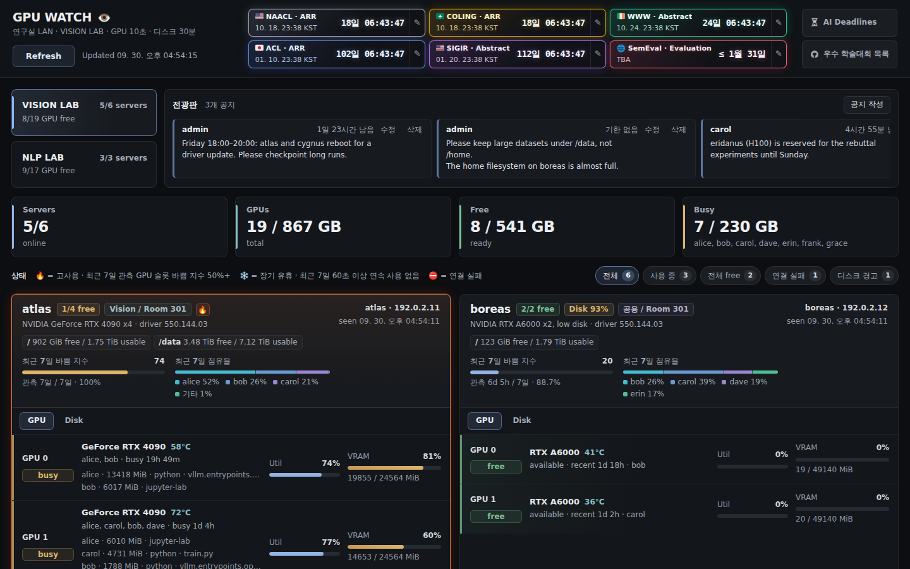

# GPU Watch Dashboard v2.5

研究室で共有する GPU サーバーのための、軽量でエージェント不要のダッシュボードです。いま空いている GPU、使用中の GPU を使っている人、残りのディスク容量がひと目でわかります。データは通常の SSH だけで収集します。

[](LICENSE)   

**v2.5** · 2026-10-03 リリース · GPT-6 Astra Ultra · [リリース検証](RELEASE_VALIDATION.md)

[English](README.md) | [简体中文](README.zh-CN.md) | [繁體中文](README.zh-HK.md) | **日本語** | [한국어](README.ko.md)



<sub>架空のデモデータで撮影した画面です。UI は韓国語で、技術用語は英語で表記しています。</sub>

> [!NOTE]
> この公開版には架空のサーバー一覧が含まれています。サーバー名は架空のもの、IP アドレスはドキュメント用の範囲、SSH のパスは例です。デプロイ前に自分の環境の設定に置き換えてください。認証情報、データベース、内部の運用ドキュメントはリポジトリに含めていません。

## GPU Watch を使う理由

共有サーバーでジョブを始める前には、たいてい三つのことを確かめる必要があります。どの GPU が空いているか、使用中の GPU は誰が使っているか、ディスクに十分な空きがあるかです。GPU Watch はこの三つを一つのページで答えます。

- **エージェント不要。** 各 GPU サーバーに必要なのは SSH アクセス、`nvidia-smi`、`python3` だけです。サーバーに常駐するプログラムはありません。
- **軽量。** バックエンドは Python 標準ライブラリと SQLite だけを使います。フロントエンドはビルド工程のない素の HTML、CSS、JavaScript です。
- **慎重。** プロセスの所有者を推測せず、完全なコマンドラインも表示しません。古い測定値を現在の値のように見せることもありません。

## v2.5 の変更点

- **GPU の観測値を公開前に検証。** 必須の VRAM 値が欠けている場合や不正な場合は、GPU を free と表示せず、観測時間にも加算しません。任意項目の使用率や温度が取得できなくても、有効な VRAM 観測は保持します。
- **時間別の履歴を現在の GPU 一覧に統一。** 無効化された GPU の過去の VRAM 値が、時間別の Lab Pulse チャートに加算されないよう修正しました。
- **HTTP と診断情報の境界を強化。** 重複した `Host` ヘッダーと、途中で切れた JSON リクエスト本文を拒否します。メンテナンスの health 応答には、機密情報を含む可能性のある例外メッセージではなく、例外の種類だけを表示します。
- **古いリクエストから新しい下書きを保護。** 告知やタイマーの保存・削除応答が遅れて届いても、保存済みデータを更新しつつ、新しい編集画面の下書き、フォーカス、処理中のボタン状態を保持します。タイマーの PIN もダイアログを閉じる前に消去します。
- **Windows 緊急用コピーのファイル権限を明確に制限。** 起動時に、実行時ファイルの継承または明示的な広範囲の ACL 権限を、現在のユーザー、SYSTEM、Administrators の権限に置き換えます。SSH には実際に検証した鍵を使用します。
- **既存の管理者 PIN を保持。** `ensure` は有効な旧形式のハッシュを保持し、認証成功後に更新します。保存されたハッシュが不正な場合は明示的な修復が必要で、起動時に PIN を勝手に変更しません。

既存の画面、文言、収集範囲、軽量な構成は維持しています。[リリース検証](RELEASE_VALIDATION.md) は確認した範囲と限界の記録であり、将来のあらゆる環境や障害に対する保証ではありません。

## 機能

### GPU とサーバー

- すべての GPU のリアルタイム状態：free（空き）か busy（使用中）か、使用率、VRAM、温度、使用中の時間または最終使用時刻。
- GPU ごとのプロセスと、そのユーザー、メモリ、短いコマンド要約。詳細表示では PID、開始時刻、コンテナも示しますが、完全なコマンドラインは表示しません。
- 研究室の切り替え、研究室全体のサマリー（オンラインのサーバー、free と busy の GPU、VRAM）、そして使用中・全 GPU 空き・接続失敗・ディスク警告の各フィルター。
- アクティビティバッジ：🔥 高負荷（直近 7 日間のビジー指数が 50% 以上）、❄️ 長期アイドル（7 日間、60 秒以上の連続使用なし）、⛔ 接続失敗。

### ディスク

- ファイルシステムごとの空き、使用可能、使用中、予約済みの容量。サーバーのファイルシステム全体の合計使用率が 90% に達すると Disk 警告を表示します。
- 読み取り可能なホームディレクトリと設定したパス、さらに Docker の書き込みレイヤーを合計したユーザー別使用量。集計が一部にとどまる場合、下限値は `≥`、推定値は `≈` で示します。

### 履歴と推移

- busy/free の切り替わりを記録する Recent Activity。日付、サーバー、ユーザーで絞り込めます。接続の DOWN/UP イベントは既定では非表示で、含めて表示することもできます。
- サーバーごとの直近 7 日間のビジー指数と、ユーザー別の使用割合。
- LAB DAILY INDEX：直近 24 時間の 1 時間ごとの VRAM ローソク足と、30 日間の日平均 VRAM の推移。

### 研究室向けツール

- 最大 6 件の学会締め切りカウントダウン（KST）。TBA の項目にも対応します。タイマーごとの色は変わらず、タイマー名に含まれる国旗の絵文字は同梱の SVG ファイルで描画します。
- 有効期限を任意で設定できる掲示板のお知らせ。投稿者は自分で決めたパスフレーズでお知らせを編集でき、管理者は管理者 PIN ですべてのお知らせを管理できます。
- 学会締め切りサイト、AI サービスのステータスページ、AI ニュースへのクイックリンク。Artificial Analysis Intelligence Index（上位 29 モデル）も表示します。データはサーバーが取得するため、API キーがブラウザーに渡ることはありません。

### 日常の使いやすさ

- 既定では 10 秒ごとに自動更新します。更新しても選択中のタブ、スクロール位置、キーボードフォーカスは保たれ、バックグラウンドのタブでは更新間隔を延ばします。データの更新が止まるとバナーで知らせます。
- フォームの外側をクリックしてもフォームは閉じず、フォームを閉じると入力したパスワードは消去されます。
- 検証したレイアウトは幅 320px まで対応し、OS の「動きを減らす」設定に従います。キーボード操作と文字コントラストの標本を関連する WCAG AA 基準に照らして確認しましたが、アクセシビリティ全体の認証ではありません。

## 仕組み

```text
Browser ──HTTP──▶ Caddy  (IP allowlist, compression)
                    │
                    ▼
              server.py   (HTTP API · collector · maintenance · index scheduler)
               │      │
          SSH  │      └──▶ SQLite  (data/)
               ▼
          GPU servers  (nvidia-smi · /proc · df · du · docker)
```

1. コレクターは `poll_interval_seconds`（10 秒）ごとに、`hosts.json` のすべてのホストへ並列に接続します。各ホストで `nvidia-smi` のクエリと小さなインライン Python プローブを実行します。
2. プロセスの所有者は `/proc/<pid>/status` の実効 UID と NSS 名から決めます。名前がない場合は `uid:<数字>` を使います。さらに PID の開始時刻と GPU UUID で再確認し、確認できない場合は推測せず、所有者不明として表示します。
3. ディスク使用量は `disk_poll_interval_seconds`（30 分）ごとに、別のワーカーが `df`、時間制限付きの `du`、`docker ps --size` で測定します。任意の特権ヘルパーを使うこともできます。
4. 観測値は時間区間として SQLite に保存します。重なり合う GPU、プロセス、ユーザーはまとめて扱うため、使用時間が二重に数えられることはありません。
5. ページは `/api/snapshot`、`/api/events`、`/api/insights`、`/api/intelligence-index` を読み込みます。

### 状態の判定ルール

- GPU に計算プロセスがある、VRAM を 500 MiB 以上使っている、または使用率が 10% 以上のとき、その GPU は **busy** です。二つのしきい値は設定で変更できます。
- VRAM を確保し続けているプロセスは、使用率が 0% でも busy とみなします。そのため、押さえてある GPU が free と表示されることはありません。これらの数値が示すのは占有状況であり、計算効率ではありません。
- GPU を完全に観測できなかったサーバーは **DOWN** です。診断情報では、タイムアウト、SSH の接続・認証の失敗、ドライバーやデバイスの障害を区別します。その GPU はどれも利用可能に数えず、以前の測定値を現在の値として表示しません。ディスクの取得に成功しても UP には戻しません。
- 一時的な接続エラーは、同じ時間の枠内で一度だけ再試行します。失敗していた時間を使用時間として埋めることはありません。
- NVIDIA のドライバーとライブラリのバージョン不一致に備えた、安全策付きのフォールバックがあります。明示的に承認したホストでだけ有効にでき、通常は常にネイティブのドライバーを使います。

### 時間と指数

- 複数のユーザーが一つの GPU を共有している場合、使用時間は確認できた所有者のあいだで均等に分けます。その GPU に所有者不明のプロセスが一つでもあれば、その区間は未帰属のままにし、判明しているユーザーには割り当てません。
- 60 秒未満のセッションも履歴と合計には残りますが、❄️ バッジは解除しません。長期アイドルの判定には 7 日間の追跡が必要ですが、観測率 100% は求めません。
- 直近 7 日間のビジー指数は、使用時間を観測できた GPU スロット時間で割った値です。観測できなかった時間はアイドル扱いにせず、四捨五入した観測率が 100% のときは `관측 7일 / 7일` と表示します。
- LAB DAILY INDEX は、KST の暦日ごとに、各 GPU の観測時間で重み付けした平均 VRAM を合計したものです。生の VRAM は 16 MiB 単位で保存します。

## セキュリティモデル

- **アクセス制御。** Caddy が IP 許可リストを適用します。アプリもクライアント IP、`Host`、`Origin` を独自に再確認します。
- **書き込み。** お知らせやタイマーの変更には、同一オリジンからのリクエストとパスフレーズまたは PIN が必要です。ハッシュには 600,000 回反復の PBKDF2-SHA256 を使います。ハッシュの検証は同時に 2 件までに抑え、失敗した試行はサブネット単位と全体の両方でレート制限します。
- **パスワードの入力欄。** 入力は伏せ字で表示し、オートコンプリートを無効にし、パスワードマネージャーに無視させるヒントを付け、ダイアログを閉じると消去します。それでもブラウザーが保存を提案することはあり、ページ側から完全には防げません。
- **ブラウザーに送らないもの。** リモートコマンド、stderr、完全なコマンドライン、環境変数、SSH のユーザー、ポート、パスワードです。サーバーカードには検証済みの IP アドレスだけを表示します。
- **ブラウザー側の保護。** 厳格なコンテンツセキュリティポリシー（CSP）が、インラインのスクリプトと外部のスクリプトを遮断します。静的ファイルは明示的な許可リストに沿って配信し、パストラバーサルとシンボリックリンクは拒否します。アイコンや国旗はローカルから配信します。
- **コンテナ。** root 以外のユーザーで実行し、ルートファイルシステムは読み取り専用、すべてのケーパビリティを削除し、`no-new-privileges` と PID・メモリ・ログの制限を適用します。
- **機密情報。** SSH パスワード、API キー、PIN のハッシュは git の管理対象外のランタイム用フォルダー（`secrets/`、`data/`、`operator-secrets/`）にだけ置き、リポジトリには含めません。SSH パスワードはコマンドラインではなく `SSH_ASKPASS` を通じて OpenSSH に渡します。
- **通信経路。** 平文の HTTP は信頼できる LAN 内での利用を前提にしています。IP による制限は暗号化の代わりにはなりません。より広く公開する前に、TLS と認証を追加してください。

## 動作要件

| 場所 | 必要なもの |
|---|---|
| ダッシュボードのホスト | Python 3.12（標準ライブラリのみ）と OpenSSH クライアント、または Docker |
| 各 GPU サーバー | 監視用アカウントの SSH アクセス、`nvidia-smi` を含む NVIDIA ドライバー、`python3`（プローブは Python 3.6 とも互換）、`df`、GNU `du`。ホームディレクトリは不要です。Docker は任意で、あればコンテナごとの使用量も表示します。特権ディスクヘルパーを使う場合は `sudo` も必要です。 |
| 閲覧者 | 最新の Web ブラウザー |

## クイックスタート

```sh
git clone https://github.com/jumincho/gpu-watch.git
cd gpu-watch

# 1. サーバーの一覧を書き（下の「設定」を参照）、SSH の鍵と known_hosts を確認します。
$EDITOR hosts.json

# 2. 管理者 PIN を作成します。一度だけ使う平文の PIN の保存先が表示されます。
python3 scripts/admin-passphrase.py ensure

# 3. ダッシュボードを起動します。
python3 server.py --host 127.0.0.1 --port 8787
```

<http://127.0.0.1:8787/> を開きます。管理者 PIN は安全な場所に保管し、平文のファイルは削除してください。後から新しい 4 桁の PIN に変更するには `python3 scripts/admin-passphrase.py rotate` を実行します。

既定ではループバックのクライアントしか接続できません。LAN 内のほかのマシンから見る場合は、許可する対象を明示してください。以下のアドレスは例です。

```sh
GPU_WATCH_ALLOWED_NETWORKS="127.0.0.0/8,::1/128,192.0.2.0/24" \
GPU_WATCH_ALLOWED_HOSTS="192.0.2.10:8787,127.0.0.1:8787,localhost:8787" \
python3 server.py --host 0.0.0.0 --port 8787
```

## 設定

### `hosts.json`

同梱の `hosts.json` は架空の研究室を記述したものです。自分のサーバーに置き換えて使ってください。

```json
{
  "poll_interval_seconds": 10,
  "disk_poll_interval_seconds": 1800,
  "busy_memory_threshold_mib": 500,
  "busy_utilization_threshold_percent": 10,
  "labs": [{ "id": "vision", "label": "VISION LAB" }],
  "hosts": [
    {
      "name": "atlas",
      "label": "atlas",
      "lab": "vision",
      "ssh_host": "192.0.2.11",
      "ssh_port": 22,
      "ssh_user": "gpuwatch",
      "ssh_identity_file": "~/.ssh/id_ed25519",
      "expected_gpu_count": 4,
      "note": "NVIDIA GeForce RTX 4090 x4",
      "owner": "Vision",
      "owner_type": "assigned",
      "location": "Room 301"
    }
  ]
}
```

| ホストのフィールド | 意味 |
|---|---|
| `name` | 一意の ID（英字、数字、`.`、`_`、`-`）。`ssh_host` を省略した場合は SSH のエイリアスとしても使います。 |
| `label`、`lab` | 表示名と所属する研究室 |
| `ssh_host`、`ssh_port`、`ssh_user` | 接続先 |
| `ssh_identity_file` | 鍵認証に使う秘密鍵 |
| `ssh_password_file`、`ssh_options` | パスワード認証。パスワードファイルは `secrets/` の下に置き、実行時に読み込みます。 |
| `display_ip` | エイリアスで接続するホストのカードに表示する IP。有効な IP アドレスでなければなりません。 |
| `expected_gpu_count` | サーバーが DOWN のあいだも表示し続ける GPU の枠の数 |
| `note`、`owner`、`owner_type`、`location` | カードに表示する文言とバッジのスタイル。`assigned` または `shared`（`owner` が `공용` の場合も shared 扱い）のほか、研究室固有の `physical_ai_2` と `app_serving` があります |
| `disk_user_paths` | 追加で測定するユーザー別のパス。`{ "user": …, "path": … }` の形式です。 |
| `collect_docker_usage` | 通常のプローブで `docker ps --size` により Docker の書き込みレイヤーも測定します。既定で有効なのは `lab` が `nll` のホストだけです。ほかの研究室では明示的に設定してください。`privileged_disk_helper` はこのオプションに関係なく、固定の方針に従って Docker 使用量を常に収集します。 |
| `privileged_disk_helper` | インストールした root ヘルパーでディスク使用量を測定します。`disk_user_paths` とは併用できません。 |

このほかのトップレベルの設定には、プローブのタイムアウト、`collector_workers`、🔥 と ❄️ のバッジの基準を決める `activity_policy`、保存期間があります。

| データ | 既定の保存期間 |
|---|---|
| イベントと日次の指数 | 180 日 |
| 生の区間データ | 8 日 |
| 削除済み・期限切れのお知らせ | 削除または期限切れから 90 日。有効期限のないお知らせは削除されるまで残ります。 |
| SQLite の日次バックアップ | 14 日 |
| デプロイ前のバックアップ | 30 日 |

### 環境変数

| 変数 | 用途 | 既定値 |
|---|---|---|
| `GPU_WATCH_ALLOWED_NETWORKS` | クライアント IP の許可リスト（カンマ区切りの CIDR） | ループバック |
| `GPU_WATCH_ALLOWED_HOSTS` | 受け付ける `Host` ヘッダーの値 | ループバック |
| `GPU_WATCH_TRUSTED_PROXY_NETWORKS` | `X-Forwarded-For` ヘッダーを信頼するリバースプロキシ | ループバック |
| `GPU_WATCH_SSH_CONFIG_FILE` | 使用する OpenSSH 設定ファイルの絶対パス | なし |
| `GPU_WATCH_SSH_IDENTITY_FILE` | ホストごとの鍵ファイルの代わりに使う鍵ファイル | なし |
| `GPU_WATCH_ADMIN_PIN_HASH` | `data/admin_pin.hash` の代わりに使う管理者 PIN のハッシュ | なし |
| `GPU_WATCH_RUNTIME_MODE` | `standalone`、`production`、`emergency` のいずれか | `standalone` |
| `GPU_WATCH_BUILD_VERSION` | ヘルスチェック API が返すリリース番号。`deploy.sh` は `VERSION` との一致を求めます。 | パッケージのバージョン |

### Artificial Analysis

Intelligence Index を表示するには、API キーを `secrets/artificial_analysis_api_key` に置いてください。アプリのユーザーが所有する、シンボリックリンクではない通常のファイルで、パーミッションは `0600`、置き場所は権限を絞ったフォルダーにする必要があります。キーは試行のたびに読み直すため、再起動せずに差し替えられます。リダイレクトは拒否するので、キーがほかのオリジンに送られることはありません。ブラウザーが受け取るのはキャッシュ済みのランキングだけです。

| 状況 | 動作 |
|---|---|
| 通常 | レスポンスの `X-RateLimit-*` ヘッダーとページ数をもとに、全体の更新を利用上限の期間に均等に割り振り、最大 8 回の予備を残します |
| 1 日 100 回・4 ページ | およそ 1 時間に 1 回。15 分より短い間隔にはしません |
| 残りが少ない、または `Retry-After` を受け取った | 上限のリセットまたは指定の時刻まで待ちます |
| レート制限ヘッダーがない | 6 時間ごと |
| 更新に失敗 | 1 時間後に再試行。`Retry-After` がより長い時間を求めた場合はそれに従います |
| 48 時間を超えたデータ | 古いデータとして表示 |

- リクエストは送る前に回数を差し引くため、再起動やネットワークエラーのせいで、サーバーが回数が残っていると誤認することはありません。すべてのページを検証してから新しいランキングを公開します。
- 利用上限の状態（上限、残り回数、リセット時刻、ページ数、次の試行時刻）は、キーとは別に `data/` のキャッシュの隣に保存します。
- 閲覧者がいてもいなくても、小さなスケジューラースレッドがこれらの予定時刻を守ります。ページ自体は 5 分ごとにサーバーのキャッシュを確認します。
- 指数のバージョンは API が返す値をそのまま表示し（現在は `4.3`）、パッチ番号を付け足すことはありません。長いモデルのバリアント名は、たとえば `(max)` のように短縮します。

## 特権ディスクヘルパー

監視用アカウントがほかのユーザーのホームディレクトリを読めないサーバーでは、ユーザー別の合計が一部の集計にとどまります。そうしたサーバーには、GPU Watch 自身のディスク収集処理だけを実行する小さな root ヘルパーをインストールできます。

```sh
# レビューできるインストーラーを生成します（インストールはしません）。
python3 scripts/provision-disk-helper.py --user gpuwatch --output disk-installer.py

# disk-installer.py を確認してから GPU サーバーにコピーし、管理者権限で実行します。
sudo python3 -I disk-installer.py
```

インストーラーは `/usr/local/libexec/gpu-watch-disk`、監視用アカウントがこのヘルパーだけを引数なしで実行できるようにする sudoers のルール、`/var/cache/gpu-watch/` のキャッシュフォルダーを作成します。ヘルパーはパス、コマンド、環境変数の入力を一切受け付けません。固定の `PATH` を使い、同時実行を防ぎ、結果を 5 分間キャッシュし、低い CPU 優先度で動きます。デーモンはインストールせず、管理者のパスワードも保存しません。

インストール後、そのホストに `"privileged_disk_helper": true` を設定します。ヘルパーがない場合は、同じ時間の枠内で通常権限の取得に切り替え、ユーザー別の使用量を一部の集計として表示します。ディスクのプローブを変更したときは、ヘルパーを再インストールしてください。

## デプロイ

基準となる本番構成は、強化した二つのコンテナで動きます。外部に公開するポートは Caddy だけで、アプリは内部の Docker ネットワークにとどまります。

- `Dockerfile` は、ダイジェストで固定した `python:3.12-alpine` イメージの上にアプリをビルドします。
- `Dockerfile.caddy` は、固定したコミットと固定した依存関係のバージョンで Caddy をビルドします。
- `deploy.sh` は研究室の本番ホスト向けのデプロイスクリプトです。パスと権限を確認し、二つのイメージをビルドして候補コンテナを検証します（health、snapshot、collector）。次に以前のアプリコンテナを停止して保存し、データベースや SSH のランタイムファイルを変更する前に、チェックサム付きの検証済み SQLite バックアップを作成します。本番切り替え後に許可リストと状態を確認し、失敗すればコンテナ、SSH のランタイムファイル、データベースをロールバックします。削除するのは、このプロジェクト自身の未使用のビルドイメージだけです。ほかの環境で使う場合は、まずホスト固有のパスとアドレスを変更してください。

| コンテナ | 制限 |
|---|---|
| アプリ | root 以外のユーザー、読み取り専用のルート、ケーパビリティの削除、`no-new-privileges`、メモリ 512 MiB、PID 128 |
| Caddy | 読み取り専用のルート、メモリ 192 MiB、PID 64 |

> [!IMPORTANT]
> リリースのフィンガープリントは、`VERSION`、`server.py`、`hosts.json`、`gpu_watch/`、`static/` のハッシュです。本番と緊急用コピーで一致している必要があります。スクリプト、ドキュメント、テストはフィンガープリントの対象外なので、ファイル全体の一覧もあわせて比較してください。

### Windows の緊急フォールバック

`emergency-local-fallback.ps1 -Action Status|Start|Stop` は、本番が停止しているあいだだけローカルのコピーを実行します。使う前に、パス、アドレス、SSH の設定を自分の環境に合わせてください。

- 本番に接続できる場合、`Start` は拒否されます。意図的に引き継ぐときだけ `-Force` を付けます。その場合も `VERSION` とリリースのフィンガープリントの一致が必要で、新しい収集サイクルが成功するまで起動完了とはしません。
- アプリは標準ユーザーで動きます。Windows の UAC が必要なのは、研究室の LAN 向けのファイアウォールルールを追加するときだけです。
- `Stop` はプロセスの正確な身元を確認してから、リスナー、そのファイアウォールルール、一時的なパスワードファイルを削除します。同じポートを使う無関係なプロセスには触れません。
- ローカルのデータベースは別です。障害中に作成したお知らせやタイマーは、本番に戻す前に突き合わせてください。

## 運用

```sh
# 実行中のコンテナの状態を確認する
docker exec gpu-watch-dashboard python3 /app/scripts/check_local.py --health-only --expected-build-version 2.5

# SQLite の整合性と集計の不変条件を検査する
python3 scripts/audit-data.py data/gpu_watch.sqlite3

# ローカルのバックアップから復元する（復元先とチェックサムを検証）
sh scripts/restore-backup.sh /absolute/path/to/backup.sqlite3
```

メンテナンス処理が SQLite の日次バックアップを作成し、`deploy.sh` はデプロイのたびにもう一つバックアップを作成します。自動のオフサイトバックアップはなく、`scripts/offsite-backup.sh` は手動用のツールです。

## 開発とテスト

```sh
python3 -m unittest discover -s tests -v   # Python の回帰テストと契約テスト 284 件
node tests/test_frontend.js                # フロントエンドのチェック 25 件
```

一部のテストは Windows または POSIX 専用で、ほかの環境ではスキップされます。テスト一式は Windows か、GNU coreutils のある Linux で実行してください。最小構成の Alpine のアプリイメージは BusyBox を使うため、GNU `du` を前提としたテストは実行できません。

テストは、状態の判定ルール、区間の計算、セキュリティヘッダー、UI の文言といった製品の振る舞いも固定しています。契約テストが失敗する場合、たいていは利用者に見える変更なので、意図的な判断が必要です。マイグレーション、意味のある回帰テスト、検証済みのバックアップ、タイマーの色は残してください。UI を変更するときは、大きなストレージやプローブのコードを書き直すより、役割を絞ったモジュールを使い、計算のルールを明確に保ってください。

## ディレクトリ構成

| パス | 役割 |
|---|---|
| `server.py` | HTTP API、コレクター、ストレージ、メンテナンス |
| `gpu_watch/` | 認証、プロセスの帰属判定、セキュリティ補助、履歴、利用上限の追跡とスケジューラーを備えた Artificial Analysis クライアント |
| `static/` | フロントエンド（`index.html`、`app.js`、`styles.css`）と同梱のアイコン・国旗 |
| `hosts.json` | サーバー、研究室、収集の設定（架空の例） |
| `Caddyfile`、`Dockerfile`、`Dockerfile.caddy` | エッジプロキシとコンテナイメージ |
| `deploy.sh` | バックアップとロールバックを備えた本番デプロイ |
| `run-dashboard.ps1`、`emergency-local-fallback.ps1` | Windows の緊急用コレクター |
| `scripts/` | ヘルスチェック、データ監査、バックアップと復元、管理者 PIN、SSH の補助、ディスクヘルパーのインストーラー生成 |
| `tests/` | Python と Node のテスト |

## リリース

**v2.5** は正式ローンチ版で、2026-10-03 に GPT-6 Astra Ultra がリリースしました。ダッシュボードにはリリース情報のフッターを表示しません。リリース情報は `VERSION`、`gpu_watch/__init__.py`、この README、GitHub Releases に記載しています。

[RELEASE_VALIDATION.md](RELEASE_VALIDATION.md) には、このリリースが通過した検証を記載しています。これはこのソースのバージョンで確認した振る舞いの記録であり、将来のあらゆる環境や障害に対する保証ではありません。

## 謝辞

国旗のアイコンには CC-BY 4.0 ライセンスの [Twemoji](https://github.com/jdecked/twemoji) を使用しています。詳しくは [THIRD_PARTY_NOTICES.md](THIRD_PARTY_NOTICES.md) をご覧ください。サービスのアイコンの権利は各所有者にあり、それぞれのステータスページへのリンクを示す目的でのみ使用しています。

## ライセンス

GPU Watch は [MIT ライセンス](LICENSE) で公開しています。同梱の国旗アイコンとサービスのアイコンはこのライセンスの対象外です。詳しくは上の謝辞をご覧ください。
